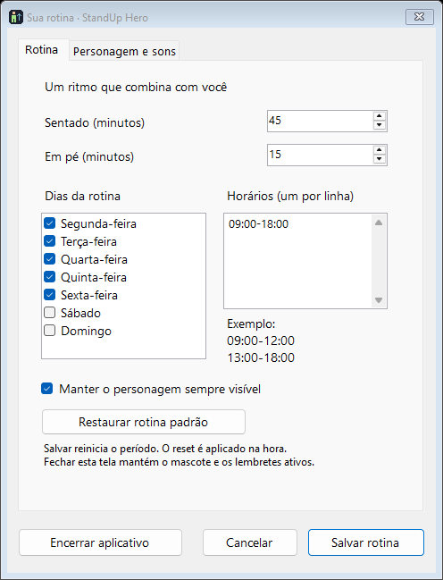
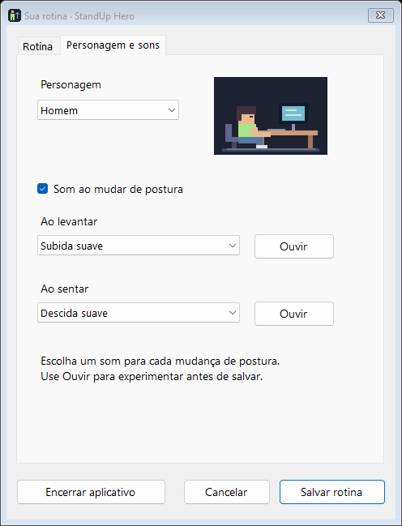

<div align="center">

# StandUp Hero

**Um pequeno companheiro de desktop para lembrar você de mudar de postura.**

Pixel art, ciclos de sentado/em pé e uma rotina que cabe no seu dia — direto no Windows.

[Baixar](https://github.com/gersonbonetti/standup-hero/releases/latest) · [Como usar](#como-usar) · [Desenvolvimento](#desenvolvimento)


</div>

## A ideia

Quem trabalha sentado pode facilmente perder a noção do tempo. O StandUp Hero transforma o lembrete de levantar em um personagem que acompanha sua rotina: ele trabalha sentado, se espreguiça, continua em pé e depois volta a sentar.

O mascote fica próximo à barra de tarefas, com fundo transparente, sem bordas e sem ocupar um botão na barra. São **140 × 96 pixels lógicos**, que você pode arrastar para onde preferir.

## O que já funciona

- **Personagem homem ou mulher**, com animações de postura e descanso.
- **Ciclos configuráveis**: 45 minutos sentado e 15 em pé por padrão.
- **Dias e horários**: segunda a sexta, das 9h às 18h por padrão; aceita vários períodos no mesmo dia, como manhã e tarde.
- **Trabalhando e jogando** seguem os ciclos; **relaxando** desativa os lembretes.
- **Pausar, continuar e trocar postura** pelo menu do personagem.
- **Sons separados** para levantar e sentar: Subida suave, Descida suave, Sino e Arcade, com prévia e opção de silêncio.
- **Restaurar rotina padrão**, preservando a escolha do personagem e dos sons.
- **Bandeja do Windows**, com ícone próprio, opção de ocultar e notificações nas mudanças de postura.
- **Preferências locais**, sem conta, servidor ou envio de dados pela aplicação.

## Configurações

<table>
  <tr>
    <td align="center"><strong>Sua rotina</strong></td>
    <td align="center"><strong>Personagem e sons</strong></td>
  </tr>
  <tr>
    <td></td>
    <td></td>
  </tr>
</table>

## Baixar e executar

1. Abra a página de [releases](https://github.com/gersonbonetti/standup-hero/releases/latest).
2. Baixe **StandUpHero-v0.1.1-win-x64.zip**.
3. Extraia **todo o conteúdo** para uma pasta.
4. Execute **StandUpHero.exe**.

O pacote portátil inclui o runtime .NET e não exige instalação do SDK. A distribuição disponível é para **Windows x64**. Mantenha o executável junto dos demais arquivos extraídos.

Esta é uma versão inicial, sem instalador, atualização automática ou assinatura digital. O Windows pode solicitar confirmação ao abrir o arquivo baixado.

## Como usar

| Ação | Como fazer |
| --- | --- |
| Mover o mascote | Arraste o personagem ou a mesa. |
| Consultar o tempo | Passe o mouse sobre o mascote. |
| Mudar atividade ou postura | Clique com o botão direito e escolha a ação. |
| Configurar a rotina | Dê dois cliques no mascote ou escolha **Configurar rotina** no menu. |
| Alterar personagem e sons | Abra a aba **Personagem e sons** e clique em **Salvar rotina**. |
| Voltar ao padrão | Na aba **Rotina**, clique em **Restaurar rotina padrão**. A mudança é salva e aplicada imediatamente. |
| Ocultar | Escolha **Ocultar (manter lembretes)**; os ciclos continuam ativos. |
| Mostrar novamente | Dê dois cliques no ícone da bandeja. |
| Encerrar | Escolha **Encerrar aplicativo** nas configurações, no menu do mascote ou na bandeja. |

Fechar a tela de configurações volta ao mascote e mantém os lembretes ativos. Para parar os avisos e encerrar o processo, use **Encerrar aplicativo**. O app não instala um serviço do Windows.

A partir da v0.1.1, apenas uma instância pode rodar por sessão do Windows. Abrir o executável novamente mostra o mascote já existente, mesmo que ele esteja oculto ou tenha sido aberto de outra pasta.

**Atualizando da v0.1.0:** encerre todas as cópias antigas antes de abrir a nova versão. Se necessário, finalize os processos `StandUpHero.exe` antigos pelo Gerenciador de Tarefas; uma cópia antiga não conhece a proteção de instância única.

### Como os ciclos se comportam

- O aplicativo segue o horário e o fuso local do Windows.
- Os períodos configurados são compartilhados entre todos os dias selecionados. Para uma pausa de almoço, use, por exemplo, `09:00-12:00` e `13:00-18:00`.
- Cada nova janela de atividade começa com um período sentado. Abrir o aplicativo no meio de um horário também inicia um ciclo completo.
- Fora dos dias e horários escolhidos, ou em **Relaxando**, não há lembretes.
- **Pausar** preserva o tempo restante enquanto você continua dentro do horário ativo. **Trocar postura** inicia a duração completa da outra etapa.
- Salvar configurações, restaurar a rotina padrão ou mudar a atividade reinicia o ciclo. O reset é imediato e preserva personagem e sons já salvos; fechar a tela depois dele não desfaz a restauração.
- Após suspensão do computador, uma etapa vencida avança uma vez ao retomar; avisos atrasados não são reproduzidos em sequência.
- As notificações podem ser silenciadas pelas configurações do Windows. Os sons do aplicativo podem ser desativados nas opções.

### Dados locais

As preferências ficam em:

```text
%LOCALAPPDATA%/StandUpHero/settings.json
```

O arquivo guarda dias, horários, durações, atividade, personagem e sons. Os recursos visuais e sonoros estão incorporados ao aplicativo; não é necessário acesso à internet para usá-lo.

## Desenvolvimento

Projeto em **C#**, **Windows Forms** e **.NET 8**, sem pacotes NuGet de terceiros. Para compilar, use Windows com o **SDK .NET 8 ou superior**.

```powershell
git clone https://github.com/gersonbonetti/standup-hero.git
cd standup-hero
dotnet run --project StandUpHero.csproj
```

### Testes e compilação

```powershell
dotnet run --project tests/RoutineChecks.csproj
dotnet run --project tests/windows/LifecycleChecks.csproj
dotnet build StandUpHero.csproj -c Release
```

Os 18 testes da rotina cobrem transições, pausa, horários, dias, modo relaxando, retomada após suspensão, sobreposição de períodos e compatibilidade das preferências. Outros 12 testes no Windows verificam instância única entre processos, reset imediato e encerramento dos recursos.

Há também uma verificação visual que abre temporariamente as telas, salva capturas e verifica o reset sem gravar preferências:

```powershell
dotnet run --project StandUpHero.csproj -- --check-ui artifacts/ui
```

### Gerar o pacote portátil

```powershell
dotnet publish StandUpHero.csproj -c Release -r win-x64 --self-contained true -o artifacts/release/StandUpHero
Compress-Archive -Path artifacts/release/StandUpHero/* -DestinationPath artifacts/StandUpHero-v0.1.1-win-x64.zip -Force
```

Para uma distribuição menor, dependente do **.NET Desktop Runtime 8** no destino:

```powershell
dotnet publish StandUpHero.csproj -c Release -o dist
```

### Estrutura

| Arquivo | Responsabilidade |
| --- | --- |
| `Program.cs` | Mascote, bandeja, menu e renderização pixel art. |
| `SingleInstance.cs` | Impede timers duplicados e mostra o mascote existente ao reabrir. |
| `Routine.cs` | Ciclos, agenda, preferências e persistência. |
| `SettingsWindow.cs` | Tela de configuração e restauração do padrão. |
| `AppAssets.cs` | Ícone e reprodução dos sons incorporados. |
| `Assets/` | Ícone em várias resoluções e quatro sons WAV. |
| `scripts/generate_assets.py` | Geração reproduzível do ícone e dos sons com a biblioteca padrão do Python. |
| `tests/` | Verificações da lógica, sem framework externo. |

## Limitações atuais

- O mascote fica acima da barra de tarefas; não se incorpora à barra do Windows.
- A posição do mascote não é salva entre execuções.
- Não inicia automaticamente com o Windows.
- Os horários são iguais para todos os dias selecionados; períodos que cruzam a meia-noite não são aceitos.
- Ainda não há instalador, suporte nativo a macOS/Linux ou personalização de sprites e arquivos de áudio pelo usuário.

## Feedback

Encontrou um problema ou tem uma sugestão? [Abra uma issue](https://github.com/gersonbonetti/standup-hero/issues) com o comportamento esperado, o que aconteceu e, se possível, os passos para reproduzir.

## Licença

Nenhuma licença de uso ou distribuição foi definida para o projeto por enquanto.
