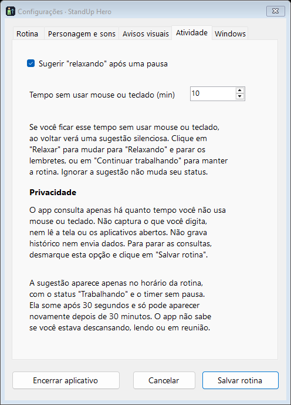
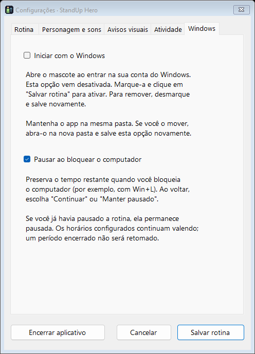
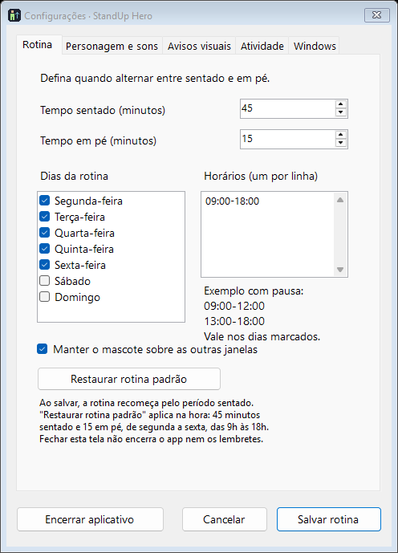
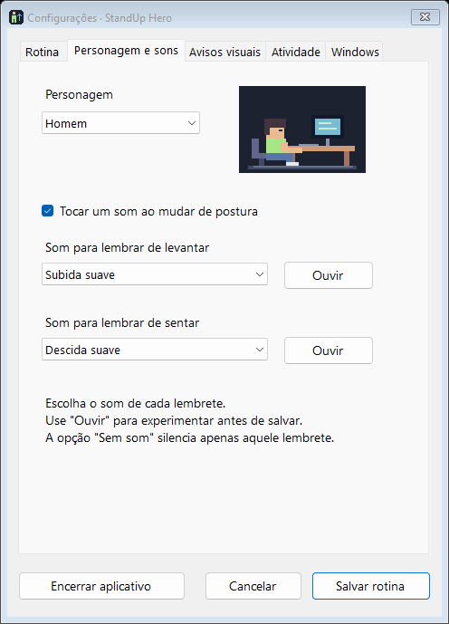
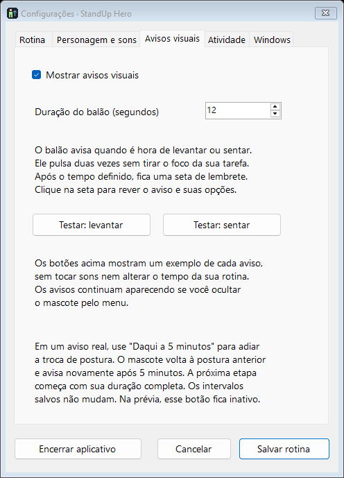

<div align="center">

# StandUp Hero

**Um pequeno companheiro de desktop para lembrar você de mudar de postura.**

Pixel art, ciclos de sentado/em pé e uma rotina que cabe no seu dia — direto no Windows.

[Baixar](https://github.com/gersonbonetti/standup-hero/releases/latest) · [Como usar](#como-usar) · [Desenvolvimento](#desenvolvimento)


</div>

## A ideia

Criei o StandUp Hero porque não encontrei um projeto que atendesse ao que eu procurava: um lembrete visual, simples e configurável para sair da cadeira durante o trabalho, integrado à área de trabalho. Daí veio a ideia de um pequeno personagem que acompanha esses momentos comigo. O apelido extraoficial é **Minha Coluna Hero**. 🙂

Quem trabalha sentado pode facilmente perder a noção do tempo. O StandUp Hero transforma o lembrete de levantar em um personagem que acompanha sua rotina: ele trabalha sentado, se espreguiça, continua em pé e depois volta a sentar.

O mascote fica próximo à barra de tarefas, com fundo transparente, sem bordas e sem ocupar um botão na barra. São **140 × 96 pixels lógicos**, que você pode arrastar para onde preferir.

## Como instalar

1. Abra a página de [releases](https://github.com/gersonbonetti/standup-hero/releases/latest).
2. Baixe **StandUpHero-v0.1.2-win-x64.zip**.
3. Extraia **todo o conteúdo** para uma pasta permanente, como `Documentos\StandUpHero`. Não execute de dentro do ZIP.
4. Execute **StandUpHero.exe**. O mascote aparecerá próximo à barra de tarefas.
5. Dê dois cliques no mascote para ajustar dias, horários, personagem e avisos.

Para atualizar, use **Encerrar aplicativo**, extraia a nova versão e abra o executável. Suas preferências ficam salvas separadamente. Se usa a inicialização com o Windows e mudou de pasta, salve essa opção novamente no novo local.

Para remover, desmarque **Iniciar com o Windows**, salve, encerre o app e exclua a pasta extraída.

O pacote portátil inclui o runtime .NET e não exige instalação do SDK. A distribuição disponível é para **Windows x64**. Mantenha o executável junto dos demais arquivos extraídos.

Esta é uma versão inicial, sem instalador, atualização automática ou assinatura digital. O Windows pode solicitar confirmação ao abrir o arquivo baixado.

## O que já funciona

- **Personagem homem ou mulher**, com animações de postura e descanso.
- **Ciclos configuráveis**: 45 minutos sentado e 15 em pé por padrão.
- **Dias e horários**: segunda a sexta, das 9h às 18h por padrão; aceita vários períodos no mesmo dia, como manhã e tarde.
- **Trabalhando** segue os ciclos; **Relaxando** desativa os lembretes.
- **Pausar, continuar e trocar postura** pelo menu do personagem.
- **Sons separados** para levantar e sentar: Subida suave, Descida suave, Sino e Arcade, com prévia e opção de silêncio.
- **Restaurar rotina padrão**, preservando a escolha do personagem e dos sons.
- **Bandeja do Windows**, com ícone próprio, opção de ocultar e notificações nas mudanças de postura.
- **Avisos visuais**, com balão discreto, seta persistente e botão para adiar por cinco minutos.
- **Pausa ao bloquear o PC**, com retomada mediante sua escolha.
- **Inicialização opcional com o Windows** e sugestão de relaxar ao retornar de uma pausa.
- **Preferências locais**, sem conta, servidor ou envio de dados pela aplicação.

## Sugestão discreta de atividade

Agora há apenas dois status: **Trabalhando** e **Relaxando**. Nas preferências antigas, **Jogando** é convertido para **Relaxando** sem perder outros ajustes.

Em **Configurar rotina → Atividade**, a detecção vem habilitada com um intervalo de **10 minutos** sem interação, ajustável entre 2 e 60 minutos. Após esse intervalo, **ao voltar a usar o computador**, aparece uma sugestão silenciosa: **Relaxar** ou **Continuar trabalhando**. Ela não muda o status ou o cronômetro por conta própria e some após 30 segundos. Há no máximo uma sugestão a cada 30 minutos enquanto o app estiver aberto.

Inatividade pode ser leitura, reunião ou descanso; o aplicativo não tenta distinguir essas situações. Não há sugestão fora da rotina, com o timer pausado ou em Relaxando. Avisos de postura e telas de configuração têm prioridade.

**Privacidade:** a cada 15 segundos, enquanto elegível, o app consulta apenas o tempo desde a última interação que o Windows já mantém para a sessão, usando [GetLastInputInfo](https://learn.microsoft.com/en-us/windows/win32/api/winuser/nf-winuser-getlastinputinfo). Não usa hooks de teclado/mouse, não lê quais teclas ou botões foram usados, não captura tela, não inspeciona aplicativos, não grava histórico e não envia esses dados. Somente os ajustes da opção são salvos. Desative a opção e clique em **Salvar rotina** para interromper as consultas.



## Inicialização, bloqueio e adiamento

Em **Configurar rotina → Windows**:

- **Iniciar com o Windows** vem desativado. Marque e salve para abrir o mascote ao entrar na sua conta. Desmarcar e salvar remove a entrada de inicialização do próprio app. Não exige administrador. Se mover a pasta do aplicativo, abra-o no novo local e salve essa opção novamente.
- **Pausar ao bloquear o computador** vem ativado. Ao bloquear a sessão (por exemplo, com Win+L), o tempo restante é preservado. Ao desbloquear, escolha **Continuar** ou **Manter pausado**. Uma pausa manual anterior é respeitada, sem novo pedido de confirmação. Fora do horário da rotina, o período encerrado não é retomado; se já começou outro horário, a rotina usa um novo período completo.

No aviso de mudança de postura, **Daqui a 5 minutos** adia a troca: o mascote volta à postura anterior por cinco minutos e avisa novamente. A próxima etapa começa com a duração completa e os intervalos salvos não são alterados. O botão fica desativado nas prévias. Você também pode usar **Adiar aviso por 5 minutos** no menu enquanto houver uma troca elegível. Bloquear o computador durante o adiamento preserva o tempo que faltava.

A inicialização usa apenas a entrada `StandUpHero` em `HKEY_CURRENT_USER\Software\Microsoft\Windows\CurrentVersion\Run`. O app só registra ou remove a entrada quando você salva configurações; não a reativa silenciosamente ao abrir. Os avisos de bloqueio se referem apenas à sessão atual e não exigem monitoramento de teclado, tela ou aplicativos. As outras preferências são mantidas.



## Configurações

<table>
  <tr>
    <td align="center"><strong>Sua rotina</strong></td>
    <td align="center"><strong>Personagem e sons</strong></td>
  </tr>
  <tr>
    <td></td>
    <td></td>
  </tr>
</table>

## Como usar

### Avisos visuais

O aplicativo exibe um balão acima do mascote: **Hora de ficar em pé** ou **Pode sentar novamente**. Ele pulsa suavemente duas vezes e fica visível por 12 segundos, sem tirar o foco do aplicativo em uso. Depois, vira uma pequena seta persistente. Clique na seta para rever as opções, ou no mascote para dispensar o lembrete.

Em **Configurar rotina → Avisos visuais**, você pode ajustar a duração entre 5 e 30 segundos, desativar os avisos ou testar as duas mensagens. A prévia é silenciosa e não altera o ciclo. O aviso aparece mesmo com o mascote oculto; ele acompanha sua posição e se mantém dentro do monitor. Desativar os avisos visuais não altera a preferência de som.



| Ação | Como fazer |
| --- | --- |
| Mover o mascote | Arraste o personagem ou a mesa. |
| Consultar o tempo | Passe o mouse sobre o mascote. |
| Mudar atividade ou postura | Clique com o botão direito e escolha a ação. |
| Configurar a rotina | Dê dois cliques no mascote ou escolha **Configurar rotina** no menu. |
| Alterar personagem e sons | Abra a aba **Personagem e sons** e clique em **Salvar rotina**. |
| Voltar ao padrão | Na aba **Rotina**, clique em **Restaurar rotina padrão**. A mudança é salva e aplicada imediatamente. |
| Ocultar | Escolha **Ocultar (manter lembretes)**; os ciclos continuam ativos. |
| Mostrar novamente | Dê dois cliques no ícone da bandeja. |
| Encerrar | Escolha **Encerrar aplicativo** nas configurações, no menu do mascote ou na bandeja. |

Fechar a tela de configurações volta ao mascote e mantém os lembretes ativos. Para parar os avisos e encerrar o processo, use **Encerrar aplicativo**. O app não instala um serviço do Windows.

A partir da v0.1.1, apenas uma instância pode rodar por sessão do Windows. Abrir o executável novamente mostra o mascote já existente, mesmo que ele esteja oculto ou tenha sido aberto de outra pasta.

**Atualizando da v0.1.0:** encerre todas as cópias antigas antes de abrir a nova versão. Se necessário, finalize os processos `StandUpHero.exe` antigos pelo Gerenciador de Tarefas; uma cópia antiga não conhece a proteção de instância única.

### Como os ciclos se comportam

- O aplicativo segue o horário e o fuso local do Windows.
- Os períodos configurados são compartilhados entre todos os dias selecionados. Para uma pausa de almoço, use, por exemplo, `09:00-12:00` e `13:00-18:00`.
- Cada nova janela de atividade começa com um período sentado. Abrir o aplicativo no meio de um horário também inicia um ciclo completo.
- Fora dos dias e horários escolhidos, ou em **Relaxando**, não há lembretes.
- **Pausar** preserva o tempo restante enquanto você continua dentro do horário ativo. **Trocar postura** inicia a duração completa da outra etapa.
- Salvar configurações, restaurar a rotina padrão ou mudar a atividade reinicia o ciclo. O reset é imediato e preserva personagem e sons já salvos; fechar a tela depois dele não desfaz a restauração.
- Após suspensão do computador, uma etapa vencida avança uma vez ao retomar; avisos atrasados não são reproduzidos em sequência.
- As notificações podem ser silenciadas pelas configurações do Windows. Os sons do aplicativo podem ser desativados nas opções.

### Dados locais

As preferências ficam em:

```text
%LOCALAPPDATA%/StandUpHero/settings.json
```

O arquivo guarda dias, horários, durações, atividade, personagem e sons. Os recursos visuais e sonoros estão incorporados ao aplicativo; não é necessário acesso à internet para usá-lo.

## Desenvolvimento

Projeto em **C#**, **Windows Forms** e **.NET 8**, sem pacotes NuGet de terceiros. Para compilar, use Windows com o **SDK .NET 8 ou superior**.

```powershell
git clone https://github.com/gersonbonetti/standup-hero.git
cd standup-hero
dotnet run --project StandUpHero.csproj
```

### Testes e compilação

```powershell
dotnet run --project tests/RoutineChecks.csproj
dotnet run --project tests/windows/LifecycleChecks.csproj
dotnet build StandUpHero.csproj -c Release
```

Os testes de rotina, preferências e inatividade cobrem transições, pausa, horários, dias, modo relaxando, retomada após suspensão, sobreposição de períodos e compatibilidade das preferências. As verificações no Windows cobrem instância única, reset, encerramento, avisos visuais, sugestões, ausência de mudança automática e interrupção das consultas ao desativar a detecção.

Há também uma verificação visual que abre temporariamente as telas, salva capturas e verifica o reset sem gravar preferências:

```powershell
dotnet run --project StandUpHero.csproj -- --check-ui artifacts/ui
```

### Gerar o pacote portátil

```powershell
dotnet publish StandUpHero.csproj -c Release -r win-x64 --self-contained true -o artifacts/release/StandUpHero
Compress-Archive -Path artifacts/release/StandUpHero/* -DestinationPath artifacts/StandUpHero-v0.1.2-win-x64.zip -Force
```

Para uma distribuição menor, dependente do **.NET Desktop Runtime 8** no destino:

```powershell
dotnet publish StandUpHero.csproj -c Release -o dist
```

### Estrutura

| Arquivo | Responsabilidade |
| --- | --- |
| `Program.cs` | Mascote, bandeja, menu e renderização pixel art. |
| `SingleInstance.cs` | Impede timers duplicados e mostra o mascote existente ao reabrir. |
| `IdleDetection.cs` | Consulta mínima de inatividade e regras de sugestão, sem histórico. |
| `IdleSuggestionNotice.cs` | Sugestão silenciosa com aceitação explícita. |
| `StartupRegistration.cs` | Inicialização opcional por usuário e gravação com reversão em caso de erro. |
| `SessionNotifications.cs` | Avisos de bloqueio e desbloqueio da sessão atual. |
| `ResumeNotice.cs` | Confirmação para continuar depois do desbloqueio. |
| `Routine.cs` | Ciclos, agenda, preferências e persistência. |
| `SettingsWindow.cs` | Tela de configuração e restauração do padrão. |
| `AppAssets.cs` | Ícone e reprodução dos sons incorporados. |
| `Assets/` | Ícone em várias resoluções e quatro sons WAV. |
| `scripts/generate_assets.py` | Geração reproduzível do ícone e dos sons com a biblioteca padrão do Python. |
| `tests/` | Verificações da lógica, sem framework externo. |

## Limitações atuais

- O mascote fica acima da barra de tarefas; não se incorpora à barra do Windows.
- A posição do mascote não é salva entre execuções.
- A inicialização com o Windows é opcional e depende de manter o executável na pasta registrada.
- Os horários são iguais para todos os dias selecionados; períodos que cruzam a meia-noite não são aceitos.
- Ainda não há instalador, suporte nativo a macOS/Linux ou personalização de sprites e arquivos de áudio pelo usuário.

## Feedback

Encontrou um problema ou tem uma sugestão? [Abra uma issue](https://github.com/gersonbonetti/standup-hero/issues) com o comportamento esperado, o que aconteceu e, se possível, os passos para reproduzir.

## Licença

Nenhuma licença de uso ou distribuição foi definida para o projeto por enquanto.
